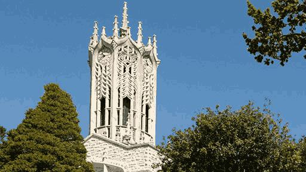

# ENGGEN 131 Image 

This project involved the use of k-means clustering to convert an image with "n" colors to a version with "k" colors. An example is shown below.

Original Image                    |  16 Colour Version
:--------------------------------:|:-------------------------:
   |  
